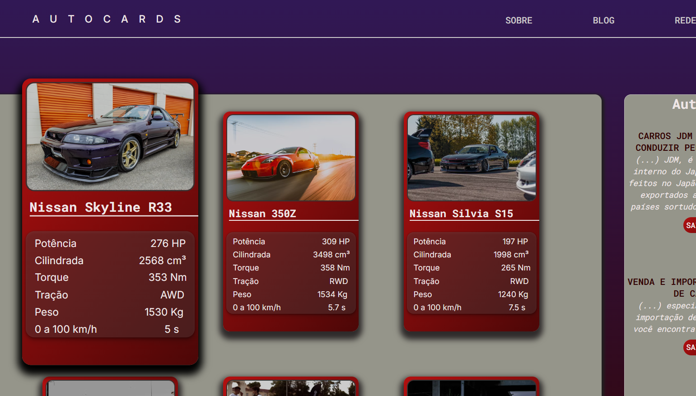

# Autocards

Projeto desenvolvido no curso de HTML e CSS da [Coderhouse](https://coderhouse.com.br/).

* [Ver Website](https://leo-formaggio.github.io/Projeto-final-coder/)

O Autocards é um Website onde você encontra informações sobre o mundo JDM e fica ligado nos maiores ícones dos carros japoneses!
## 🛠 Habilidades Utilizadas

* `HTML`

* `CSS`

## Imagem do Projeto

